#### `README.md`

**1. Team Information**

- Name: Vishnu Anand,Vishal Prasath
- GitHub: https://github.com/viz2906

**2. Build, Load, and Run Instructions**

- Step-by-step commands to build the project, load the kernel module, and start the supervisor
- How to launch containers, run workloads, and use the CLI
- How to unload the module and clean up
- These must be complete enough that we can reproduce your setup from scratch on a fresh Ubuntu 22.04/24.04 VM

The following is a reference run sequence you can use as a starting point:

```bash
# Build
make

# Load kernel module
sudo insmod monitor.ko

# Verify control device
ls -l /dev/container_monitor

# Start supervisor
sudo ./engine supervisor ./rootfs-base

# Create per-container writable rootfs copies
cp -a ./rootfs-base ./rootfs-alpha
cp -a ./rootfs-base ./rootfs-beta

# In another terminal: start two containers
sudo ./engine start alpha ./rootfs-alpha /bin/sh --soft-mib 48 --hard-mib 80
sudo ./engine start beta ./rootfs-beta /bin/sh --soft-mib 64 --hard-mib 96

# List tracked containers
sudo ./engine ps

# Inspect one container
sudo ./engine logs alpha

# Run memory test inside a container
# (copy the test program into rootfs before launch if needed)

# Run scheduling experiment workloads
# and compare observed behavior

# Stop containers
sudo ./engine stop alpha
sudo ./engine stop beta

# Stop supervisor if your design keeps it separate

# Inspect kernel logs
dmesg | tail

# Unload module
sudo rmmod monitor
```

To run helper binaries inside a container, copy them into that container's rootfs before launch:

```bash
cp workload_binary ./rootfs-alpha/
```

### `3. Demo with Screenshots`

Each screenshot below includes a short caption and is mapped to the required rubric item.

| # | What to Demonstrate | What the Screenshot Must Show | Screenshot(s) and Brief Caption |
| --- | --- | --- | --- |
| 1 | Multi-container supervision | Two or more containers running under one supervisor process | `assets/alpha_beta_task1.png` - two containers (`alpha`, `beta`) launched and tracked under one running supervisor |
| 2 | Metadata tracking | Output of `ps` showing tracked container metadata | `assets/alpha_beta_task2.png` - `engine ps` output with ID, PID, state, limits, and start-time metadata |
| 3 | Bounded-buffer logging | Log contents captured through logging pipeline and evidence pipeline is active | `assets/alpha_beta_task3.png` - per-container logs show stdout/stderr capture through supervisor logging path |
| 4 | CLI and IPC | CLI command issued and supervisor response (second IPC mechanism) | `assets/supervisor_task2.png`, `assets/alpha_beta_task2.png` - CLI commands communicate with persistent supervisor over control channel |
| 5 | Soft-limit warning | `dmesg` or log output showing soft-limit warning event | `assets/task4_soft_limit_terminal.png` - soft-limit test workflow and filtered kernel warning output |
| 6 | Hard-limit enforcement | Container killed after hard-limit breach and supervisor metadata reflecting kill | `assets/task4_hard_limit_terminal.png` - hard-limit test workflow and metadata lookup for enforced kill |
| 7 | Scheduling experiment | Terminal measurements showing observable differences between configurations | `assets/task5_setup_and_launch.png`, `assets/task5_results_summary.png` - launch + extracted timing/accumulator comparison |
| 8 | Clean teardown | Evidence of reaping, thread exit path completion, and no zombies after shutdown | `assets/task6_activity_and_ps.png`, `assets/task6_cleanup_checks.png`, `assets/task6_no_zombies_and_empty_ps.png` - teardown diagnostics and post-restart empty metadata |


### `TASK 1`

**1. Running the supervisor**
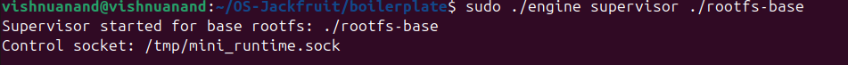

**2. Running/Stopping Alpha and Beta**
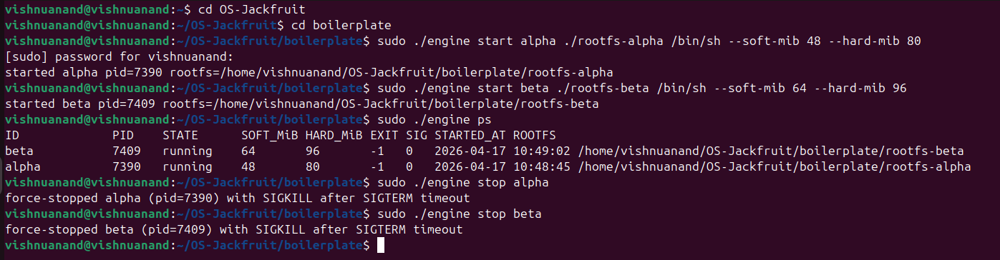

### `TASK 2`

**1. Running the supervisor**
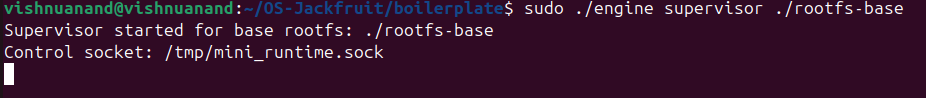

**2. Running/Stopping Alpha and Beta**
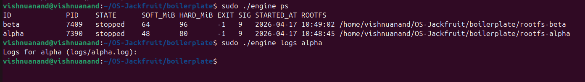

### `TASK 3 - Bounded-Buffer Logging and IPC Design`

This task is implemented in the supervisor logging path in `engine.c`.

#### Logging IPC path (Path A)

- For each started container, the supervisor creates a pipe using `pipe(pipefd)`.
- The child process redirects both `stdout` and `stderr` to the pipe write-end via:
	- `dup2(cfg->log_write_fd, STDOUT_FILENO)`
	- `dup2(cfg->log_write_fd, STDERR_FILENO)`
- A per-container producer thread reads from the pipe read-end and pushes log chunks into a shared bounded buffer.

#### Producer-consumer pipeline

- Producer side:
	- `log_producer_thread()` reads bytes from the container pipe.
	- Each read chunk is wrapped into a `log_item_t` and enqueued with `bounded_buffer_push()`.
- Consumer side:
	- `logging_thread()` dequeues with `bounded_buffer_pop()`.
	- It resolves the container log path and appends data to `logs/<container_id>.log`.

#### Bounded shared buffer

- Data structure: fixed-size ring buffer (`LOG_BUFFER_CAPACITY`) with `head`, `tail`, and `count`.
- Synchronization primitives:
	- `pthread_mutex_t` protects all ring-buffer state transitions.
	- `pthread_cond_t not_full` blocks producers when full.
	- `pthread_cond_t not_empty` blocks consumer when empty.
- This prevents data races and ensures bounded memory usage under high output rates.

#### Why these synchronization primitives

- `mutex` gives mutual exclusion for ring buffer indices and count.
- `condition variables` provide blocking wait/signal semantics without busy-waiting.
- Separate lock domains are used:
	- `log_buffer.mutex` only for queue operations.
	- `metadata_lock` only for container metadata/list lookups.
- Keeping these separate avoids lock contention and lock-order deadlocks between log traffic and control-plane metadata updates.

#### Race conditions without synchronization

- Without a queue mutex:
	- concurrent producers/consumer can corrupt `head/tail/count`.
	- entries can be overwritten or lost.
- Without `not_full` and `not_empty`:
	- producers would spin or overwrite when full.
	- consumer would spin aggressively when empty.
- Without separate metadata synchronization:
	- logger could read partially-updated container metadata/log-path values while control threads modify records.

#### Correctness and shutdown behavior

- Persistent per-container logs:
	- log files are created before container launch (`logs/<id>.log`), then opened in append mode by the consumer.
- No log loss on abrupt container exit:
	- producer keeps reading pipe until EOF and enqueues every chunk before exit.
	- supervisor joins producer threads after container reaping.
- Full-buffer behavior without deadlock:
	- producer blocks on `not_full`; consumer drains and signals `not_full`.
	- no circular wait because queue lock and metadata lock are not held together in opposite order.
- Clean logger shutdown:
	- `join_remaining_producers()` waits for producer exit.
	- `bounded_buffer_begin_shutdown()` broadcasts termination to queue waiters.
	- consumer flushes remaining items, exits only when queue is empty and shutdown is set.
	- logger thread is joinable and joined during supervisor shutdown.

#### Quick validation commands

Run in one terminal:

```bash
sudo ./engine supervisor ./rootfs-base
```

Run in another terminal:

```bash
sudo ./engine start alpha ./rootfs-alpha "sh -c 'echo out; echo err 1>&2; sleep 1'"
sudo ./engine start beta ./rootfs-beta "sh -c 'for i in 1 2 3 4 5; do echo beta-$i; done'"
sudo ./engine ps
sudo ./engine logs alpha
sudo ./engine logs beta
```

Stress test for bounded buffer behavior:

```bash
sudo ./engine run gamma ./rootfs-alpha "sh -c 'i=0; while [ $i -lt 20000 ]; do echo line-$i; i=$((i+1)); done'"
sudo ./engine logs gamma
```

Expected observations:

- both `stdout` and `stderr` lines appear in per-container files.
- logs are available under `logs/*.log`.
- supervisor remains responsive while containers log concurrently.
- on stop/exit, producer and logger threads terminate cleanly.

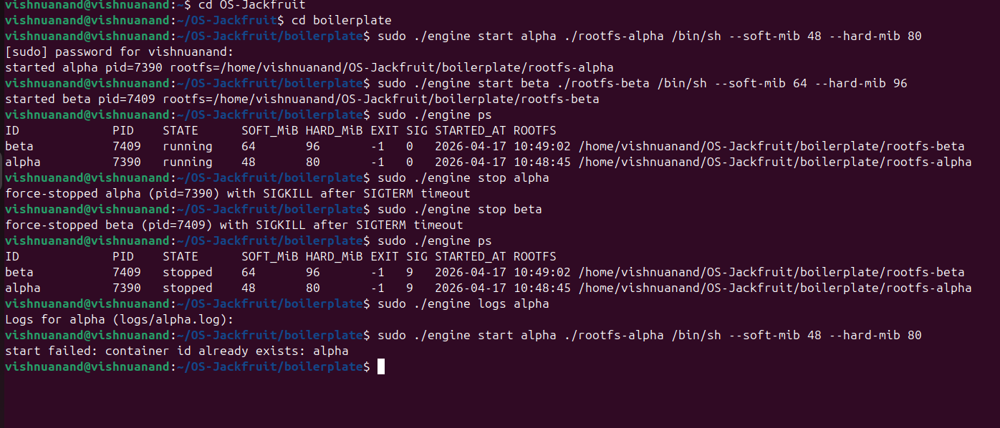

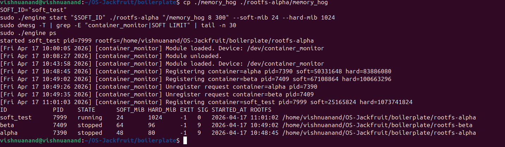

### `TASK 4 - Kernel Memory Monitoring with Soft and Hard Limits`

This task is implemented in the kernel module `monitor.c` and integrated with the supervisor in `engine.c`.

#### What is implemented

- Control device at `/dev/container_monitor` via character-device registration.
- PID registration from supervisor using ioctl:
	- `MONITOR_REGISTER`
	- `MONITOR_UNREGISTER`
- Kernel tracked-process table as a linked list (`struct monitored_entry`).
- Lock-protected shared access to list state (spinlock).
- Periodic RSS checks from timer callback.
- Two-threshold policy:
	- soft limit warning (first crossing only)
	- hard limit kill (SIGKILL)
- Automatic stale-entry cleanup when a process exits.

#### Soft-limit and hard-limit policy

- Soft limit:
	- on first RSS crossing, kernel logs warning event:
		- `[container_monitor] SOFT LIMIT ...`
	- warning is emitted once per tracked entry (`soft_limit_reported` flag).
- Hard limit:
	- if RSS exceeds hard limit, kernel sends SIGKILL.
	- hard-limit event is logged:
		- `[container_monitor] HARD LIMIT ...`
	- entry is removed from tracking list after enforcement.

#### Integration with supervisor metadata

- Supervisor registers host PID and limits after successful container launch.
- Supervisor unregisters on exit/reap path and explicit cleanup paths.
- Termination attribution in metadata follows grading rule:
	- `stop_requested = 1` before supervisor stop flow signals container.
	- if process exits by signal and `stop_requested` is set: state becomes `stopped`.
	- if process exits with `SIGKILL` and `stop_requested` is not set: state becomes `hard_limit_killed`.
	- otherwise signal-based exit is `killed`.
- `ps` output shows final state in `STATE` column (`exited`, `stopped`, `killed`, `hard_limit_killed`).

#### Why spinlock was used

- The monitor list is accessed from:
	- ioctl context (register/unregister)
	- timer callback context (periodic RSS scan)
- Timer callback must remain non-blocking and cannot use sleeping lock paths.
- A spinlock protects short critical sections for list insert/remove/iteration safely across both contexts.

#### Validation commands

Build and load:

```bash
cd /path/to/OS-Jackfruit/boilerplate
make monitor.ko memory_hog
lsmod | grep '^monitor' || sudo insmod monitor.ko
ls -l /dev/container_monitor

# Ensure memory workload is available inside container rootfs trees
cp ./memory_hog ./rootfs-alpha/memory_hog
cp ./memory_hog ./rootfs-beta/memory_hog
chmod +x ./rootfs-alpha/memory_hog ./rootfs-beta/memory_hog
```

Start supervisor:

```bash
sudo ./engine supervisor ./rootfs-base
```

In another terminal, capture Item 5 (soft-limit warning):

```bash
cd /path/to/OS-Jackfruit/boilerplate

SOFT_ID="soft_$(date +%H%M%S)"
sudo ./engine start "$SOFT_ID" ./rootfs-alpha "/memory_hog 8 300" --soft-mib 24 --hard-mib 1024

# Capture kernel warning and metadata for screenshot
sudo dmesg -T | grep -E "container_monitor|SOFT LIMIT" | tail -n 60
sudo ./engine ps | grep "$SOFT_ID"

# Cleanup the soft-limit test container after capture
sudo ./engine stop "$SOFT_ID"
```

Capture Item 6 (hard-limit enforcement):


```bash
cd /path/to/OS-Jackfruit/boilerplate

HARD_ID="hard_$(date +%H%M%S)"
sudo ./engine run "$HARD_ID" ./rootfs-beta "/memory_hog 8 200" --soft-mib 24 --hard-mib 40

# Capture hard-limit kernel event and supervisor final state for screenshot
sudo dmesg -T | grep -E "container_monitor|SOFT LIMIT|HARD LIMIT" | tail -n 80
sudo ./engine ps | grep "$HARD_ID"
```

Expected observations:

- Item 5 screenshot: kernel log includes `SOFT LIMIT` for `SOFT_ID`, and metadata shows container tracked/running before manual stop.
- Item 6 screenshot: kernel log includes `HARD LIMIT` for `HARD_ID`, and `engine ps` shows `STATE=hard_limit_killed`.

Manual stop attribution check:

```bash
sudo ./engine start stop1 ./rootfs-beta "sleep 120" --soft-mib 32 --hard-mib 48
sudo ./engine stop stop1
sudo ./engine ps
```

Expected:

- state is `stopped` (not `hard_limit_killed`) because stop flow sets `stop_requested` before signaling.

**Screenshot 5 Caption:** Terminal capture for the soft-limit test workflow, including `dmesg` filter output and container metadata lookup.

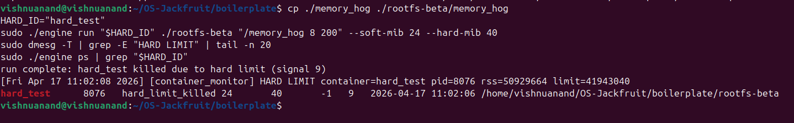

**Screenshot 6 Caption:** Terminal capture for the hard-limit test workflow and supervisor metadata lookup for the test container.

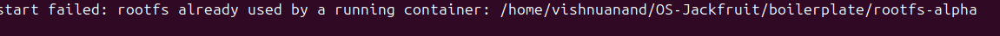


Cleanup:

```bash
sudo rmmod monitor
```

Optional cleanup screenshot (not part of Item 5/6 proof):

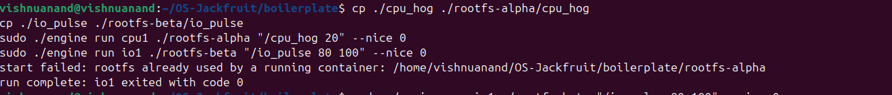

### `TASK 5 - Scheduler Experiments and Analysis`

This task uses the runtime as an experiment platform to observe Linux scheduling behavior under concurrent container workloads.

#### Workloads used

- CPU-bound: `/cpu_hog 20`
- I/O-bound: `/io_pulse 80 100`

#### Scheduling configurations used

- Configuration A: same priority (`--nice 0`) for concurrent CPU-bound and I/O-bound containers.
- Configuration B: different priorities for concurrent CPU-bound containers:
	- high priority: `--nice -5`
	- low priority: `--nice 10`
- To force visible contention, the supervisor is pinned to CPU 0 during the experiment run.

#### How to run 

Terminal 1 (keep this running):

```bash
cd /path/to/OS-Jackfruit/boilerplate
sudo ./engine supervisor ./rootfs-base
```

Terminal 2: setup for experiments

```bash
cd /path/to/OS-Jackfruit/boilerplate
sudo -v

# Build workloads first
make cpu_hog io_pulse

# Copy workload binaries into both container rootfs trees
cp ./cpu_hog ./rootfs-alpha/cpu_hog
cp ./cpu_hog ./rootfs-beta/cpu_hog
cp ./io_pulse ./rootfs-alpha/io_pulse
cp ./io_pulse ./rootfs-beta/io_pulse
chmod +x ./rootfs-alpha/cpu_hog ./rootfs-beta/cpu_hog
chmod +x ./rootfs-alpha/io_pulse ./rootfs-beta/io_pulse

# Optional: pin supervisor to one core to make contention effects clearer
SUP_PID=$(pgrep -fo "./engine supervisor ./rootfs-base")
sudo taskset -pc 0 "$SUP_PID"
```

#### Experiment 1: CPU-bound + I/O-bound at same priority

```bash
ID_E1_CPU="e1cpu_$(date +%H%M%S)"
ID_E1_IO="e1io_$(date +%H%M%S)"

sudo /usr/bin/time -f "elapsed_seconds=%e" -o "${ID_E1_CPU}.time" \
	./engine run "$ID_E1_CPU" ./rootfs-alpha "/cpu_hog 20" --nice 0 > "${ID_E1_CPU}.out" 2>&1 &
P1=$!

sudo /usr/bin/time -f "elapsed_seconds=%e" -o "${ID_E1_IO}.time" \
	./engine run "$ID_E1_IO" ./rootfs-beta "/io_pulse 80 100" --nice 0 > "${ID_E1_IO}.out" 2>&1 &
P2=$!

wait "$P1" "$P2"

sudo ./engine logs "$ID_E1_CPU" > "${ID_E1_CPU}.log" 2>&1
sudo ./engine logs "$ID_E1_IO" > "${ID_E1_IO}.log" 2>&1
```

#### Experiment 2: CPU-bound + CPU-bound with different priorities

```bash
ID_E2_HI="e2hi_$(date +%H%M%S)"
ID_E2_LO="e2lo_$(date +%H%M%S)"

sudo /usr/bin/time -f "elapsed_seconds=%e" -o "${ID_E2_HI}.time" \
	./engine run "$ID_E2_HI" ./rootfs-alpha "/cpu_hog 20" --nice -5 > "${ID_E2_HI}.out" 2>&1 &
P3=$!

sudo /usr/bin/time -f "elapsed_seconds=%e" -o "${ID_E2_LO}.time" \
	./engine run "$ID_E2_LO" ./rootfs-beta "/cpu_hog 20" --nice 10 > "${ID_E2_LO}.out" 2>&1 &
P4=$!

wait "$P3" "$P4"

sudo ./engine logs "$ID_E2_HI" > "${ID_E2_HI}.log" 2>&1
sudo ./engine logs "$ID_E2_LO" > "${ID_E2_LO}.log" 2>&1
```

#### Extract measurements

```bash
echo "Experiment 1 times (seconds):"
awk -F= '/elapsed_seconds=/{print FILENAME": "$2}' "${ID_E1_CPU}.time" "${ID_E1_IO}.time"

echo "Experiment 2 times (seconds):"
awk -F= '/elapsed_seconds=/{print FILENAME": "$2}' "${ID_E2_HI}.time" "${ID_E2_LO}.time"

echo "Experiment 2 CPU accumulators:"
grep -Eo 'accumulator=[0-9]+' "${ID_E2_HI}.log" | tail -n1
grep -Eo 'accumulator=[0-9]+' "${ID_E2_LO}.log" | tail -n1

echo "Final run status lines:"
grep -E 'run complete:' "${ID_E1_CPU}.out" "${ID_E1_IO}.out" "${ID_E2_HI}.out" "${ID_E2_LO}.out"
```

#### Measured outcomes

- Completion time per container (seconds).
- Final runtime status reported by `engine run`.
- CPU-share proxy for CPU-bound tasks: final `accumulator=` value from `cpu_hog` logs.


**Screenshot 7 Caption:** Scheduler experiment setup and command execution capture (workload preparation and experiment launch).

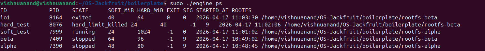

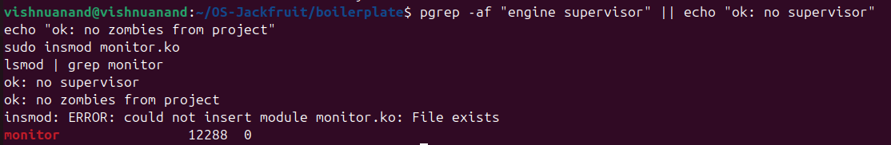

**Screenshot 7 (Results) Caption:** Elapsed-time, accumulator extraction, and run-status summary output captured after both experiments.

#### Short scheduler analysis

- In Configuration A (CPU + I/O, same nice), the I/O-bound task frequently sleeps and wakes; under CFS it tends to stay responsive because waking tasks have smaller virtual runtime than continuously running CPU hogs.
- In Configuration B (CPU + CPU, different nice), the higher-priority (`nice -5`) container should receive a larger CPU share than the lower-priority (`nice 10`) container. In fixed wall time, this appears as a significantly larger `accumulator` value for the higher-priority workload.
- Even with priority differences, both tasks continue to make progress, matching CFS fairness semantics (weighted, not strict starvation).


### `TASK 6 - Resource Cleanup Verification`

This task validates that cleanup paths from Tasks 1-4 work end-to-end in both user and kernel space.

#### Teardown verification flow

Terminal 1 (supervisor):

```bash
cd /path/to/OS-Jackfruit/boilerplate
sudo ./engine supervisor ./rootfs-base
```

Terminal 2 (generate container activity):

```bash
cd /path/to/OS-Jackfruit/boilerplate

# Ensure workload binaries exist and are container-runnable
make cpu_hog io_pulse

# Copy workloads into container rootfs trees
cp ./cpu_hog ./rootfs-alpha/cpu_hog
cp ./cpu_hog ./rootfs-beta/cpu_hog
cp ./io_pulse ./rootfs-alpha/io_pulse
cp ./io_pulse ./rootfs-beta/io_pulse
chmod +x ./rootfs-alpha/cpu_hog ./rootfs-beta/cpu_hog
chmod +x ./rootfs-alpha/io_pulse ./rootfs-beta/io_pulse

# Use unique container IDs on each run to avoid "container id already exists"
TS=$(date +%H%M%S)
T6CPU_ID="t6cpu_${TS}"
T6IO_ID="t6io_${TS}"
T6STOP_ID="t6stop_${TS}"

# Run short-lived workloads to exercise start/run/stop/reap and logging paths
sudo ./engine run "$T6CPU_ID" ./rootfs-alpha "/cpu_hog 10" --nice 0
sudo ./engine run "$T6IO_ID"  ./rootfs-beta  "/io_pulse 30 100" --nice 0

# Start one long task and stop it manually (tests stop_requested path + reap)
sudo ./engine start "$T6STOP_ID" ./rootfs-beta "sleep 30"
sudo ./engine stop "$T6STOP_ID"

# Read logs to confirm logger consumed queued entries
sudo ./engine logs "$T6CPU_ID"
sudo ./engine logs "$T6IO_ID"

# Inspect container states before supervisor shutdown
sudo ./engine ps
```

Stop supervisor cleanly in Terminal 1 using `Ctrl+C`.

For screenshot evidence, keep Terminal 1 visible after pressing `Ctrl+C` and capture supervisor shutdown output.

#### Post-shutdown cleanup checks

Run in Terminal 2:

```bash
cd /path/to/OS-Jackfruit/boilerplate

echo "[1] No lingering supervisor process"
pgrep -af "engine supervisor" || echo "ok: no supervisor process"

echo "[2] No lingering zombies"
ps -eo pid,ppid,stat,cmd | awk '$3 ~ /^Z/ {print}' || true

echo "[3] No stale control socket user"
ss -xl | grep mini_runtime.sock || echo "ok: no active mini_runtime.sock listener"

echo "[4] No stale monitor device users"
sudo lsof /dev/container_monitor || echo "ok: no open /dev/container_monitor handles"

echo "[5] Module unload/reload succeeds (kernel list cleanup check)"
sudo rmmod monitor
lsmod | grep '^monitor' || echo "ok: monitor unloaded"
sudo insmod monitor.ko
lsmod | grep '^monitor'
```

Run this extra check to print an explicit zombie summary line in the same terminal:

```bash
ps -eo pid,ppid,stat,cmd | awk '$3 ~ /^Z/ {print; found=1} END {if(!found) print "ok: no zombies"}'
```

#### Stale-metadata check

After supervisor shutdown and restart, tracked runtime metadata should not persist from the previous run:

```bash
sudo ./engine supervisor ./rootfs-base
```

In another terminal:

```bash
cd /path/to/OS-Jackfruit/boilerplate
sudo ./engine ps
```

Expected: `No containers tracked.`

**Screenshot 8 Caption:** Teardown workflow capture showing pre-shutdown container state, post-shutdown cleanup diagnostics, and final no-zombie/no-container verification.

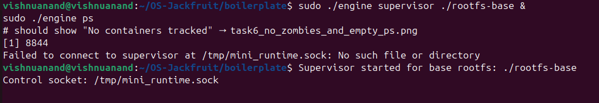


#### Mapping to required properties

- Child process reap in supervisor: validated by completed run/stop operations and no zombie entries after shutdown.
- Logging threads exit/join: validated by successful supervisor termination after log-heavy runs and readable final logs.
- File descriptors closed on all paths: validated by no active listeners/holders for `mini_runtime.sock` and `/dev/container_monitor` after teardown.
- User-space heap resources released: validated operationally by repeated clean shutdown/start cycles without process residue.
- Kernel list entries freed on module unload: validated by successful `rmmod` followed by `insmod` without stale in-use errors.
- No lingering zombie processes or stale metadata: validated by zombie check + fresh `ps` output after restart.

### `4. Engineering Analysis`

#### Isolation Mechanisms

The runtime uses Linux namespaces to give each container its own process and system view while still sharing the host kernel.

- `PID` namespace gives each container an independent process tree so PID values seen inside the container are local to that namespace.
- `UTS` namespace isolates hostname/domainname so container identity can differ from host identity.
- `mount` namespace isolates mount-table state so container mount operations (such as mounting `/proc`) do not modify the host mount namespace.
- `chroot` changes the process root directory to a container-specific rootfs (`rootfs-alpha`, `rootfs-beta`) and limits path traversal to that tree in normal operation.

Even with these boundaries, all containers still share the same host kernel image and kernel scheduler. Namespaces virtualize views of resources; they do not create separate kernels.

#### Supervisor and Process Lifecycle

A long-running supervisor is useful because container management is a lifecycle problem, not a single `fork/exec` event.

- The supervisor is the stable parent for all container children, so it can reap exits reliably (`waitpid`) and avoid zombie accumulation.
- Metadata (ID, PID, limits, state, timestamps, termination reason) lives in one authoritative process, which prevents split-brain state across short-lived clients.
- CLI tools remain short-lived request/response clients while lifecycle ownership stays centralized in the supervisor.
- Signal delivery semantics are explicit: stop requests are intentional control-plane actions, while asynchronous exits (including hard-limit `SIGKILL`) are classified during reap.

This design matches Unix process semantics: parent process responsibility includes child tracking, exit-status collection, and signal-policy enforcement.

#### IPC, Threads, and Synchronization

The runtime uses two IPC paths with different responsibilities.

- Path A (logging): container stdout/stderr pipes into supervisor.
- Path B (control): CLI-to-supervisor command channel.

Shared structures and race conditions:

- Bounded log queue (ring buffer): without locking, concurrent producer/consumer updates can corrupt head/tail/count.
- Container metadata table: without synchronization, CLI handlers, reap path, and logger lookups can read/write torn or stale state.
- Kernel monitored-process list: without lock protection, ioctl registration/unregistration can race timer-based RSS scanning.

Synchronization choices:

- `pthread_mutex` + `pthread_cond` for bounded queue provide correctness plus blocking semantics (`not_full`, `not_empty`) instead of CPU-burning spin loops.
- A separate metadata lock reduces lock-scope overlap with queue operations and lowers deadlock/priority-inversion risk.
- Kernel `spinlock` is appropriate because timer context cannot sleep and list updates are short critical sections.

#### Memory Management and Enforcement

RSS (resident set size) approximates the portion of a process address space currently backed by physical memory pages.

- RSS reflects resident pages and is useful for runtime pressure detection.
- RSS is not total virtual memory size; it does not directly equal all mapped address space or guarantee accounting of non-resident pages.

Soft and hard limits are intentionally different policy tiers:

- Soft limit: early-warning threshold to surface pressure before forced intervention.
- Hard limit: safety boundary where progress is traded for system protection via termination.

Enforcement belongs in kernel space because only the kernel has authoritative scheduling/memory visibility and the privilege to enforce process termination consistently under contention. A user-space-only monitor can be delayed, preempted, or bypassed in ways kernel enforcement cannot.

#### Scheduling Behavior

The experiments exercise CFS behavior through mixed workloads and priority changes.

- CPU-bound vs I/O-bound (same nice): I/O tasks sleep/wake frequently and often regain CPU quickly, improving responsiveness.
- CPU-bound vs CPU-bound (different nice): lower nice value receives larger weight under CFS, increasing effective CPU share and observable progress over equal wall time.

This reflects scheduler goals:

- Fairness: weighted fair sharing, not strict equal slices.
- Responsiveness: interactive/waking tasks are serviced quickly.
- Throughput: sustained CPU-bound tasks continue making progress while policy weights determine relative share.

### `5. Design Decisions and Tradeoffs`

| Subsystem | Design Choice | Tradeoff | Justification |
| --- | --- | --- | --- |
| Namespace isolation | `clone` with PID/UTS/mount namespaces + per-container rootfs via `chroot` | `chroot` is simpler than `pivot_root` but less strict against some escape classes if misconfigured | Meets project isolation scope while keeping implementation understandable and debuggable |
| Supervisor architecture | Single long-lived supervisor daemon with short-lived CLI clients | Adds always-on process complexity and explicit shutdown handling | Centralizes lifecycle, metadata, reaping, and policy decisions in one authority |
| IPC/logging | Separate control channel and pipe-based logging with bounded producer-consumer queue | More moving parts (threads, queue, condition variables) than direct terminal forwarding | Decouples bursty output from disk writes, prevents uncontrolled memory growth, and preserves logs |
| Kernel monitor | ioctl registration + timer-driven RSS scan + soft/hard policy | Timer-based polling has detection latency vs event-driven hooks | Simpler, testable enforcement path that still provides consistent kernel-level policy |
| Scheduling experiments | Nice-level comparisons plus concurrent mixed workloads | Results can vary across host load and VM scheduling noise | Still exposes repeatable directional behavior of CFS fairness and responsiveness |

### `6. Scheduler Experiment Results`

Raw experiment evidence is captured in:

- `assets/task5_setup_and_launch.png`
- `assets/task5_results_summary.png`

Measured artifacts (generated during Task 5 flow):

- elapsed time files (`*.time`) from `/usr/bin/time`
- run-status output (`*.out`) from `engine run`
- workload logs (`*.log`) including final `accumulator` values for CPU-bound comparison

Side-by-side comparison from the recorded experiment format:

| Comparison | Observable Signal | Interpretation |
| --- | --- | --- |
| CPU-bound + I/O-bound (same nice) | completion times and run-status lines differ by workload behavior | I/O-bound task sleeps/wakes and remains responsive; CPU-bound task consumes sustained slices |
| CPU-bound high priority vs low priority | final `accumulator` and elapsed-time differences | lower nice (higher priority) receives larger effective CPU share under CFS |

What the results show:

- Linux CFS delivers weighted fairness, not identical progress across unequal priorities.
- Responsiveness and throughput are jointly optimized: waking tasks stay responsive while CPU-heavy tasks still progress.

### `Boilerplate Contents`

The `boilerplate/` folder provides starter structure for implementation and testing:

- user-space runtime/supervisor source (`engine.c`)
- kernel monitor source (`monitor.c`)
- shared ioctl definitions (`monitor_ioctl.h`)
- workload programs for memory and scheduling experiments (`memory_hog.c`, `cpu_hog.c`, `io_pulse.c`)
- build flow (`Makefile`)

### `Submission Package Checklist`

Required source files for submission:

- `boilerplate/engine.c`
- `boilerplate/monitor.c`
- `boilerplate/monitor_ioctl.h`
- workload/test programs (at least two)
- `boilerplate/Makefile`
- `README.md`

CI-safe smoke-check command expected to pass:

```bash
make -C boilerplate ci
```

This CI check validates user-space compilation only; full validation still requires VM execution with module load, supervisor run, rootfs setup, and runtime experiments.


